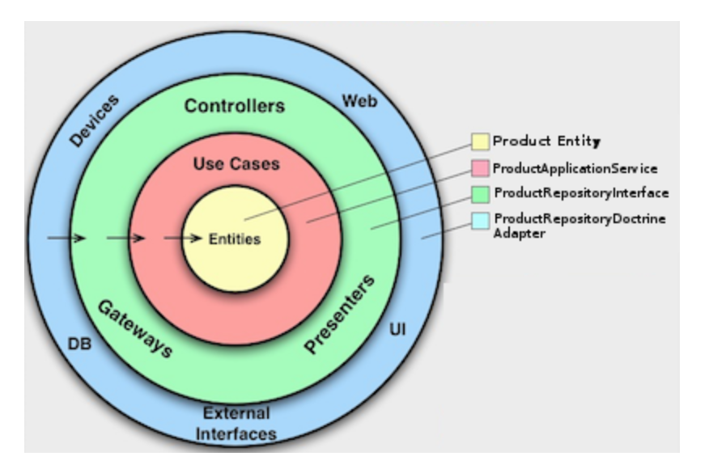
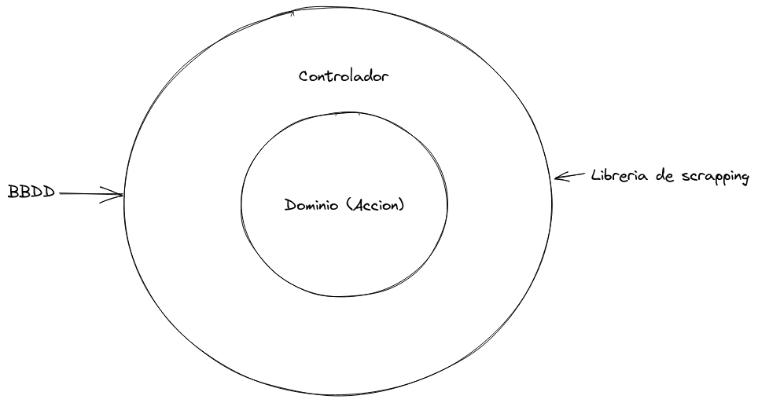

# Avantio backend prueba

## Features

### Run api on dev mode

make up-dev

The app is opened on port 3000 so localhost:3000 should return Hello world

### Tests

#### Execute all test

make test-all

#### Execute unit test

make test-unit

#### Execute infraestructure test

make test-infraestructure

#### Execute e2e test

make test-e2e

# Descripcion del proyecto

## Estructura de la api

La api consta de varios endpoints.
Por un lado tenemos el servicio de actualizacion de noticias '/updateFeed'

Por otro lado tenemos un CRUD de feed

get -> '/feed'

delete -> '/feed/:id'

create -> '/feed'

update -> '/feed'

La idea al diseñar esta api a sido seguir el estandar de el mismo verbo pero con distinto tipo de llamada.

## Estructura del proyecto

Arquitectura hexagonal/ arquitectura por capas

La idea de esta arquitecturas es tener la aplicacion montada sobre capas que permiten testear mejor la aplicacion y permite a la aplicacion desacoplarse de las tecnologias externas.

Para entender la aplicacion empezaremos por los casos de uso.
Para este proyecto hay 6 casos de uso:

- Crear Feed
- Eliminar Feed
- Obtener todos los feeds
- Obtener un feed en concreto
- Actualizar un feed
- Scrapear ElMundo y ElPais para actualizar feeds.

Estos casos de uso estan definidos en la carpeta `actions`

Estos casos de uso estan desacoplados por un lado del scrapper y por otro de la base de datos a la que atacan.

Esto se ve que por ejemplo con el caso de uso `UpdateFeedService`.
Por constructor le paso que libreria de scraping quiero usar y a que repositorio tiene que atacar para guardar los datos.
Por lo tanto si el dia de mañana la libreria de scraping ya no sirve o la bbdd se cambia solo habria que cambiarle desde el controlador, pero el caso de uso y sus tests unitarios seguirian funcionando perfectamente.

En este caso el servicio `UpdateFeedService` no es consciente de a que base de datos tiene que guardar o que servicio de scraping tiene que usar.

## Tests

Estan todos en la carpeta `src/test`

- Test unitarios

Para testear la logica de las acciones.

- Test infraestructura

Para testear que las interacciones con la base de datos funcionan correctamente

- Test e2e/ aceptacion

Test que verifiquen que todo el flujo funciona, desde el controlador hasta la bbdd

## Commits

Para este proyecto he seguido la estructura que esta definida como conventional commits (https://www.conventionalcommits.org/en/v1.0.0/)

PAra seguir esta estructura hay una extension para VSCode llamada Conventional Commits (https://marketplace.visualstudio.com/items?itemName=vivaxy.vscode-conventional-commits) que permite crear commits estructurados.

Para entender la estructura de los commits hay que revisar el archivo `TODO`.
El codigo que hay en el commit corresponde a la tarea creada en ese TODO.
En el caso de que se use jira o cualquier otro software los commits quedarian tal que asi:

`<tipo de commit>(Id de la tarea): Titulo, Descripcion`

## Disclaimer

El proyecto no esta perfecto, hay muchas mejoras que estan anotadas en el archivo `TODO`
